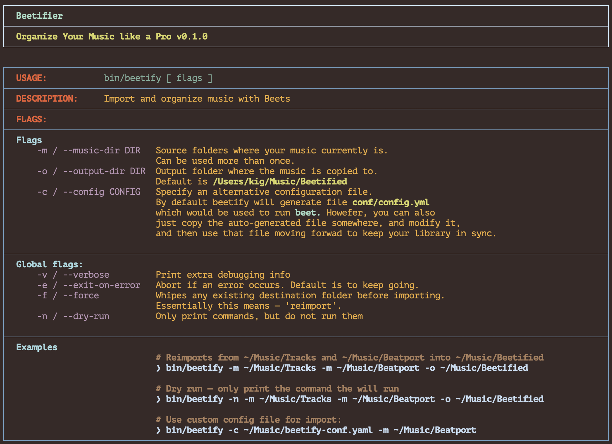
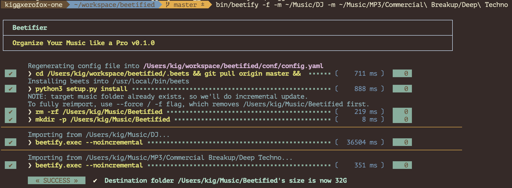

= Beetified® — Music Management Project using Beets for DJs
:title: "DJ BeetRoot® — Music Management Project using Beets for DJs"
:source-highlighter: rouge
:rouge-style: base16.monokai
:safe: unsafe
:allow-uri-read:
:doctype: book
:toc:
:toclevels: 4
:sectnums:
:icons: font

NOTE: This software is distributed under the  MIT License.

== Introduction 

This project uses https://beets.readthedocs.io/en/stable/index.html[Beets] open source project to organize DJ music.

Here is the example of the directory structure resulted by running this script:

[small]
----
 ~/Music/Beetified  tree
.
└── tracks
    ├── afro-house
    │   ├── 2018
    │   │   ├── milk-&-sugar:winter-sessions-2018.02.dan-dale-(original-mix)-(120bpm).mp3
    │   │   └── milk-&-sugar:winter-sessions-2018.12.solaris-(original-mix)-(121bpm).mp3
    │   └── 2019
    │       ├── defected:disc-2:-defected-ibiza-2k19.02:06.raw-uncut-(louie-vega-remix)-(123bpm).mp3
    │       ├── toolroom-toolroom-productions-2019:disc-3:-toolroom-ibiza-2k19.03:04.the-ride-(original-mix)-(122bpm).mp3
    │       ├── toolroom:disc-3:-toolroom-ibiza-2k19.03:04.the-ride-(original-mix)-(122bpm).mp3
    │       └── traxsource:disc-5:-traxsource-weekend-weapons-chart-(20th-sept-2k19).05:23.life-(original-mix).mp3
    ├── alternative-rock
    │   └── 2009
    │       └── :shooting-stars.01.shooting-stars-(original)-(125bpm).mp3
    ├── balkan-beats
    │   └── 0000
    │       └── :electro-swing.com-exclusive.00.hoop-e-kack-original-version-(et013)-(115bpm).mp3
    ├── breaks
    │   ├── 2010
    │   │   └── bombstrikes:keep-pounding.01.keep-pounding-(original-mix)-(113bpm).mp3
    │   ├── 2012
    │   │   ├── :diversion-slippery-triplet.00.diversion-(original-mix)-(133bpm).mp3
    │   │   ├── :rockin-ep.00.rockin-(original-mix)-(134bpm).mp3
    │   │   ├── acida-records:first-episode.01.sonorous-(colombo-remix)-(134bpm).mp3
    │   │   ├── elektroshok-records:take-me-to-the-top.02.take-me-to-the-top-(beta-remix)-(130bpm).mp3
    │   │   ├── freshly-squeezed-music:swingrowers-(pronounced-swing-growers).06.this-is-swing-(original-mix)-(126bpm).mp3
    │   │   ├── guesthouse-music:do-work.01.in-the-lab-(original-mix)-(130bpm).mp3
    │   │   └── spektra-recordings:funk-u-feel-da-bass.01.feel-da-bass-(original-mix)-(135bpm).mp3
    │   ├── 2013
    │   │   ├── ibreaks:station-21-(the-album).01.station-21-(original-mix)-(134bpm).mp3
    │   │   └── marine-parade:adam-freeland-remixes.01.summertime-sadness-(adam-freeland-vox-mix)-(063bpm).mp3
    │   └── 2014
    │       ├── acida-records:caronte.01.caronte-(colombo-remix)-(134bpm).mp3
    │       ├── bombtraxx-records:second-drop:-8-years-of-bombtraxx.05.left-behind-(beta-remix)-(134bpm).mp3
    │       ├── cognitive-music:brightness.01.brightness-(original-mix)-(134bpm).mp3
    │       ├── cognitive-music:feel-my-love.02.feel-my-love-(colombo-remix)-(132bpm).mp3
    │       ├── divergence:clap-&-bounce-remixes.01.clap-&-bounce-(colombo-remix)-(134bpm).mp3
    │       ├── ibreaks:hankering.01.hankering-(original-mix)-(134bpm).mp3
    │       ├── ibreaks:this-is-awesome.01.this-is-awesome-(original-mix)-(134bpm).mp3
    │       ├── ibreaks:this-is-awesome.02.do-it-now-(original-mix)-(134bpm).mp3
    │       ├── spektra-recordings:breaks-need-moar-swing.01.breaks-need-moar-swing-(original-mix)-(135bpm).mp3
    │       ├── spektra-recordings:spain-is-different.01.spain-is-different-(original-mix)-(135bpm).mp3
    │       ├── straight-up!:straight-up-breaks!-vol.-8.07.bk3-(original-mix)-(133bpm).mp3
    │       └── succession-records:sinking.01.sinking-(original-mix)-(132bpm).mp3====    
----

[NOTE]
====
Some shortcuts:

 * https://beets.readthedocs.io/en/stable/reference/cli.html#[Beets CLI]
 * https://beets.readthedocs.io/en/stable/reference/config.html[Beets Configuration]
 * https://beets.readthedocs.io/en/stable/plugins/index.html[Beets Plugins]
====

For example, let's say you have several folders full of DJ tracks:

 * `~/Music/DJ/Beatport, ~/Music/DJ/Amazon, /Volumes/Apple Music` — are all giant collections where your music is stored. These directory are called "source folders", and they are never written to.

The script provided here can copy files from any number of folders while applying an opinionated set of renaming and organizational rules. THe underlying software implementing the move is `beet`, but we provide out the box configuration and the shell wrapper for it.

 * For instance, let's say you want to organize music from all of the above folders into a single directory under `~/Music/Beetified`.

All you need to do, is to clone this repo, and then:

[source,bash]
----
git clone git@github.com:kigster/beetified.git
cd beetified
bin/beetify \
    -m '~/Music/DJ/Beatport' \
    -m '~/Music/DJ/Amazon' \
    -m '/Volumes/Apple Music' \
    -o ~/Music/Beetified
----

And vola! The script will the rest.

== USAGE

The script offers extensive help screen:

[source,bash]
bin/beetify --help

You should see the following:

=== An Example

Whenever you run this command, an ERB file `conf/config.yaml.erb` is rendered
as `conf/config.yaml` — you can copy this file elsewhere and then use it with the `-c / --config`
arguments to the `bin/beetify` script.

